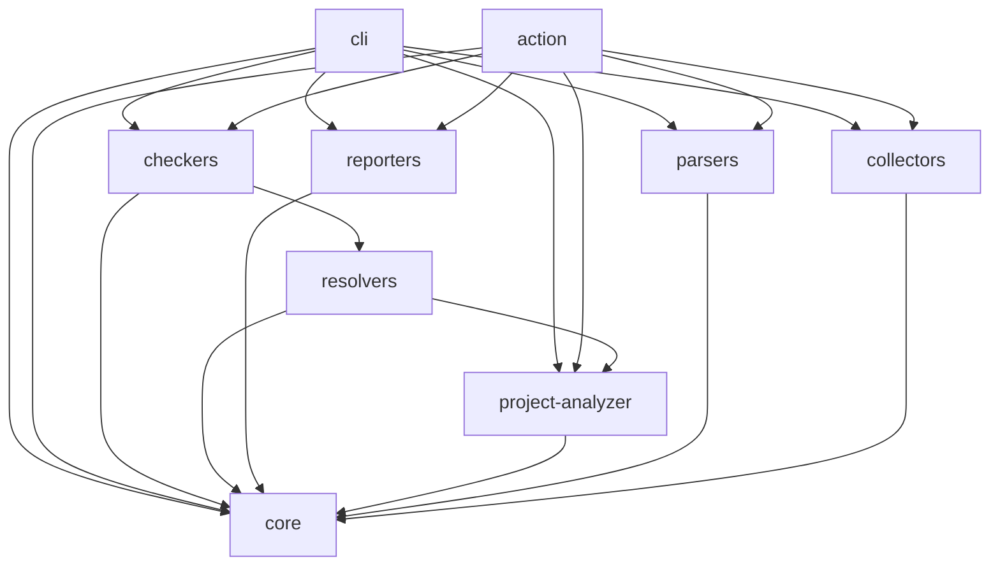

# Docs Guard Architecture

Docs Guard uses a modular monorepo structure. Each subsystem has a single, well-defined responsibility with strict, unidirectional dependency flows.

---

## Component Layout

---

## Package Directory Explanations

| Package | Directory | Responsibility |
| :--- | :--- | :--- |
| `@docs-guard/core` | `packages/core` | Core type system, configurations, metadata schema models, and base orchestrator interfaces. |
| `@docs-guard/collectors` | `packages/collectors` | File discovery and Git difference detection (for `changed-only` mode). |
| `@docs-guard/parsers` | `packages/parsers` | Parses Markdown documents into AST representation and extracts fenced code blocks or syntax elements. |
| `@docs-guard/project-analyzer` | `packages/project-analyzer` | Examines project metadata (reads `package.json`, environment configurations, exports configurations, and tsconfig paths). |
| `@docs-guard/resolvers` | `packages/resolvers` | Maps parsed documentation references to actual codebase entities (checking module exports, script definitions, etc.). |
| `@docs-guard/checkers` | `packages/checkers` | Implementation of rule checkers (syntax validation, package script verification, export checking). |
| `@docs-guard/reporters` | `packages/reporters` | Formats validation results for output (Terminal rendering, JSON payload export, and GitHub Summary Markdown). |
| `@docs-guard/cli` | `packages/cli` | Command-line interface definitions and parameters. |
| `@docs-guard/action` | `packages/action` | GitHub Action runner wrapper to load pipeline context programmatically inside CI. |

---

## Processing Pipeline Stages

Every verification run goes through the following sequence:

1. **Config Load**: Resolves options from `docsguard.config.json` and overrides them with CLI parameters.
2. **File Discovery**: Gathers files matching `include` patterns and applies `exclude` rules. Filters using git diffs if `changedOnly` is active.
3. **Project Analysis**: Analyzes target project configuration, loading defined scripts, module export boundaries, and environment examples.
4. **Parse & Extract**: Converts documentation pages into ASTs and parses them to identify code blocks, commands, and imports.
5. **Classify**: Assigns semantic kinds to extracted items (e.g. `code_snippet`, `api_reference`, `script_reference`).
6. **Resolve Reference**: Verifies if the classified item references are present in the target project codebase context.
7. **Verify**: Runs enabled rule checks in parallel, reporting findings and warnings.
8. **Aggregate**: Collects findings and applies glob overrides and severity checks.
9. **Report**: Sends outputs to stdout/stderr, JSON documents, or GitHub CI step summaries.
10. **Exit**: Terminates with exit code `0` if all checks pass, `1` if failures are found, and `2` for fatal bootstrap errors.
